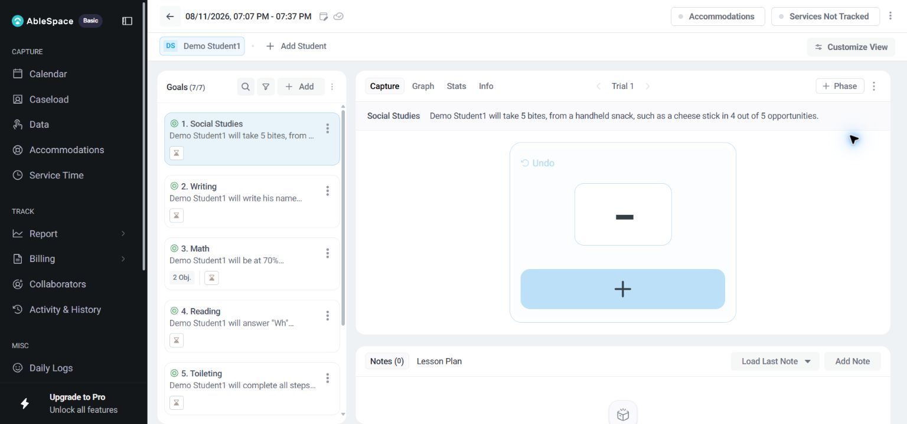
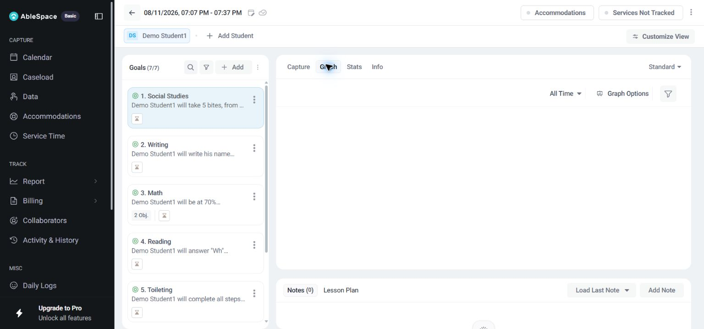

# AbleSpace Take Data Review

## Scope And Privacy

This review is based on direct inspection of AbleSpace's **Caseload > Take Data** workflow on August 11, 2026. The account displayed only a demo student and demo school. No real-client data was captured, and no measurement, note, goal, session, or setting was created or changed while reviewing the product.

## Observed Workflow

1. From **Caseload**, each student row includes a **Take Data** action. Selecting it opened a session-focused screen for the chosen student.
2. The session header showed a date and time range, selected student, optional accommodations, service tracking status, and a **Customize View** control.
3. The left pane presented a searchable and filterable list of goals. Selecting a goal made its full statement available in the main workspace.
4. In **Capture**, the chosen goal showed a frequency input labelled **Correct Attempts**, undo state, trial navigation, phase controls, and an explicit **Save** button. The same screen also exposed Notes and Lesson Plan panels.
5. In **Graph**, the product exposed a standard graph view with an all-time range selector, graph options, and filters.
6. In **Stats**, the product exposed an all-time data table, an **Add Data** action, a download action, and a performance-summary area. This screen was inspected but is not included as evidence because it displayed historical note content that was unnecessary for the walkthrough.

## Evidence

### Capture Screen

The capture view keeps the student, goal queue, active goal, trial state, measurement control, and note area on one screen. The screenshot contains only the provider's demo account.

### Graph Screen

The graph view is available directly beside Capture, with time-range, graph-options, and filter controls.

## Evidence-Based Improvements

### 1. Make The Measurement Control Self-Describing

**Observed friction:** The active Capture view uses a very large plus/minus control while the semantic label appears separately as **Frequency Correct Attempts**. A provider can understand the control after inspection, but the current visual hierarchy does not immediately say what a click records or show the current value prominently.

**Proposed change:** Place a persistent label such as **Correct attempts: 0** directly above the stepper, give both buttons text tooltips, and show a short confirmation after each entry such as **Trial 1 recorded: 1 correct attempt**.

**Expected outcome:** Faster and safer in-session data entry, especially when switching among goals under time pressure.

### 2. Surface Unsaved-State Feedback Before Leaving A Goal

**Observed friction:** Capture has a Save button and multiple navigation paths, including another goal, another student, Graph, Stats, and the back button. The reviewed screen did not make an unsaved-trial state visually obvious before using those paths.

**Proposed change:** Show a compact sticky status near the session header: **Saved**, **Unsaved changes**, or **Saving**. When switching goals or leaving with unsaved changes, use a clear confirmation dialog that names the affected goal.

**Expected outcome:** Fewer accidentally lost measurements without forcing providers to stop and re-check the full screen.

### 3. Improve Goal Scanability In The Left Queue

**Observed friction:** The goal pane shows seven cards, each containing long goal text, and several labels repeat. The active goal is highlighted, but a provider must read dense snippets to distinguish similar goals quickly.

**Proposed change:** Keep the full statement in the main pane, but add a concise goal type or measurement badge to each queue card, such as **Frequency**, **Accuracy**, or **Prompt Level**. Allow a compact queue mode that shows the goal name, measurement type, and current session progress.

**Expected outcome:** Quicker goal selection and less scanning during a live session.

### 4. Preserve Sensitive Notes By Default

**Observed friction:** The Stats view can display historical note text in its data table. This is useful for context but can expose sensitive behavioural details whenever the screen is shared or exported.

**Proposed change:** Mask note previews by default behind a **Show note** action, provide a role-aware export setting, and include a visible privacy reminder before downloading records.

**Expected outcome:** Better privacy handling without removing access for authorized providers.

### 5. Explain Empty Or Unavailable Visualizations

**Observed friction:** The graph surface exposes controls even when no plotted data is visible for the selected range. A new provider may not know whether the issue is the date range, filter, goal configuration, or lack of data.

**Proposed change:** Show an explicit empty state that names the active range and filter, then offer a direct reset action or a link to the relevant data entries.

**Expected outcome:** Less trial-and-error and faster access to meaningful progress trends.

## Screenshot Index

- `docs/assets/take-data/capture-demo.png`: Capture workflow for a demo student.
- `docs/assets/take-data/graph-demo.png`: Graph workflow for the same demo student.

No screenshot from the Stats screen is included because it showed historical note text that was not necessary to demonstrate the workflow.
